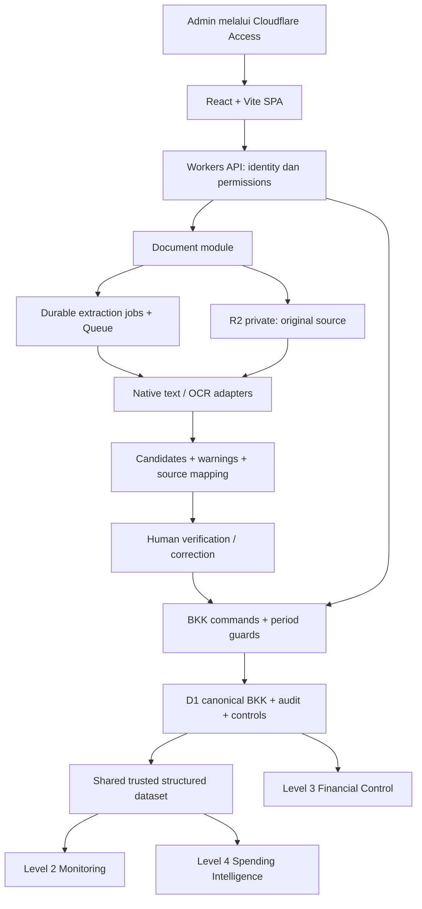

# LEVEL 6 — TECHNOLOGY ARCHITECTURE REPORT

Project: **Rekap BKK Otomatis**  
Version: **Technical Architecture v1 — PROPOSED**  
Tanggal audit: **30 September 2026, Asia/Bangkok**  
Status Level 6: **OPEN — keputusan eksplisit diperlukan sebelum LOCKED**

Audit actual repository sudah dilakukan. Repository adalah project baru dengan satu README; tidak ada stack aplikasi yang perlu dipertahankan atau diganti. Semua desain di bawah adalah rekomendasi untuk implementasi baru, bukan fitur yang telah tersedia, bukan bukti production readiness, dan bukan perubahan terhadap business rules Level 1–5.

## 1. Repository Baseline

| Item | Bukti aktual |
|---|---|
| Repository | https://github.com/achfaishal/rekap-bkk-otomatis |
| Owner | achfaishal |
| Visibility | **PUBLIC**, berdasarkan metadata GitHub |
| Default branch | main |
| Commit audited | 1d0cc5cb8685f6a5ba7a9bf58517d8e8d5fef1eb |
| Commit message | Initial commit |
| Commit timestamp | 2026-09-30 15:10:42 UTC / 22:10:42 UTC+7 |
| Branch inventory | main; metadata menyatakan protected=false |
| File inventory | README.md, 130 bytes; recursive tree tidak truncated |
| README content | Nama project dan deskripsi aplikasi internal Finance |
| Runtime / framework / package manager | Belum didefinisikan di repo |
| Deployment | Tidak ditemukan konfigurasi atau bukti deployment di repo |

Bukti: [commit](https://github.com/achfaishal/rekap-bkk-otomatis/commit/1d0cc5cb8685f6a5ba7a9bf58517d8e8d5fef1eb), [README pada commit audit](https://github.com/achfaishal/rekap-bkk-otomatis/blob/1d0cc5cb8685f6a5ba7a9bf58517d8e8d5fef1eb/README.md), recursive Git tree dan branch metadata melalui plugin GitHub. Inventaris mencakup seluruh tree pada commit tersebut, termasuk file konfigurasi jika ada. External Cloudflare resources/account settings tidak diaudit karena belum diberikan.

Build, typecheck, unit, integration, dan E2E **NOT RUN — tidak ada kode, manifest, atau test command**. Tidak ada klaim tests pass. Repository tidak dimodifikasi; tidak ada commit, provisioning, migration, atau deployment selama audit ini.

## 2. Existing Architecture

| Area | Existing |
|---|---|
| Language, frontend, backend/API, runtime | Tidak ada implementasi |
| Database, ORM, schema, migration | Tidak ada implementasi |
| Document/object storage, source references | Tidak ada implementasi |
| PDF parsing, OCR, extraction | Tidak ada implementasi |
| Authentication, authorization | Tidak ada implementasi |
| Environment variables / secrets configuration | Tidak ada file konfigurasi; tidak membuktikan ada/tidaknya secrets di layanan eksternal |
| Tests, CI/CD, logging, observability | Tidak ada implementasi |
| Level 1 / Level 2 / Level 3 / Level 4 | **Belum diimplementasikan di repo** |
| Level 5 integration | Requirement LOCKED dalam brief; belum ada integrasi kode |

Technical debt yang terverifikasi: belum ada fondasi engineering dan kontrol delivery. Ini gap project baru, bukan kegagalan aplikasi existing.

## 3. Architecture Assessment

Assessment dan approval adalah dua dimensi berbeda: **MISSING** berarti belum tersedia; **PROPOSED** berarti solusi belum disepakati.

| Component | Assessment | Tindakan yang direkomendasikan |
|---|---|---|
| Repository identity, main branch, README | KEEP | Pertahankan repository yang baru dibuat |
| Repo visibility dan branch controls | IMPROVE | Rekomendasi private dan checks/PR sebelum perubahan main; evaluasi fitur GitHub plan yang tersedia |
| Frontend / API / runtime | MISSING | Bangun TypeScript modular monolith |
| Database / query layer / migrations | MISSING | D1 + Drizzle + reviewed SQL migrations |
| Original documents / integrity | MISSING | R2 private + immutable keys + SHA-256 |
| Extraction / durable jobs | MISSING | Native-first provider interface + retry-safe asynchronous processing |
| Auth / permissions | MISSING | Access identity + server permission enforcement |
| Audit / concurrency / period-lock enforcement | MISSING | Durable atomic business mutations, versioning, DB guard |
| Monitoring / control / intelligence read models | MISSING | Shared canonical identity dan trusted eligibility contract |
| Tests / CI / environments / observability / recovery | MISSING | Fondasi sebelum real-data pilot |

**REPLACE: tidak ada component existing yang perlu diganti.** Preserve-before-replace berlaku: jangan mengambil stack BKM/Pantau Piutang sebagai stack existing BKK.

## 4. Recommended Target Architecture

Satu codebase dan release application. HTTP handler, queue handler, dan recovery/scheduled handler boleh berada dalam Worker application yang sama. Queue adalah transport pekerjaan extraction, bukan microservice bisnis baru. Control juga membaca record non-trusted untuk menemukan unverified/cancelled issues; financial metrics tetap membaca trusted dataset.

Module boundaries: Document, BKK Domain, Monitoring, Financial Control, Audit, Intelligence, Identity/Permissions, Infrastructure. Domain functions tidak bergantung langsung pada browser, router, R2, atau vendor OCR. Router tipis memanggil application service; service memakai repository/storage/provider adapters.

## 5. Technology Stack

Semua recommended choices berstatus **PROPOSED**; assessment existing ditampilkan terpisah.

| Layer | Existing | Recommended | Decision | Reason |
|---|---|---|---|---|
| Language | Tidak ada | TypeScript strict | MISSING → PROPOSED | Kontrak domain dan API konsisten |
| Frontend | Tidak ada | React + Vite SPA | MISSING → PROPOSED | Workflow internal; tidak memerlukan SEO/SSR |
| Backend | Tidak ada | Cloudflare Workers | MISSING → PROPOSED | Server-authoritative financial operations |
| API router | Tidak ada | Hono, hanya routing/middleware | MISSING → PROPOSED | Struktur endpoint dan auth enforcement tanpa giant handler |
| Package manager | Tidak ada | npm + committed package-lock | MISSING → PROPOSED | Sederhana untuk satu repo; install reproducible |
| Build tooling runtime | Tidak ada | Supported Node LTS untuk local/CI | MISSING → PROPOSED | Versi exact dipin saat bootstrap; bukan runtime production backend |
| Database | Tidak ada | Cloudflare D1 | MISSING → PROPOSED | Relational single source of truth, workload kecil |
| Query/schema | Tidak ada | Drizzle ORM / Kit | MISSING → PROPOSED | Typed queries dan SQL yang bisa direview |
| Migration executor | Tidak ada | Wrangler D1 migrations | MISSING → PROPOSED | Satu migration history per environment |
| Document storage | Tidak ada | R2 private | MISSING → PROPOSED | Binary source terpisah dari structured database |
| Native PDF adapter | Tidak ada | Worker-compatible parser; pdfjs-dist sebagai kandidat | MISSING → OPEN | Belum ada compatibility/accuracy benchmark |
| OCR/Vision | Tidak ada | Replaceable server-side adapter | MISSING → OPEN | Vendor production dipilih setelah benchmark |
| Durable extraction | Tidak ada | D1 job state + Cloudflare Queues + bounded recovery | MISSING → PROPOSED | Multi-document retries dan browser disconnect tidak menghilangkan pekerjaan |
| Authentication | Tidak ada | Cloudflare Access | MISSING → CONDITIONAL PROPOSAL | Bergantung internal-user model/domain/identity provider |
| Authorization | Tidak ada | Central server permission policy | MISSING → PROPOSED; matrix OPEN | Role bisnis belum diberikan |
| Testing | Tidak ada | Vitest + Workers runtime integration + Playwright | MISSING → PROPOSED | Domain, platform behavior, dan workflow UI |
| Deployment | Tidak ada | Workers Static Assets + API satu origin | MISSING → PROPOSED | Satu release frontend/backend [S1] |
| CI/CD | Tidak ada | GitHub Actions | MISSING → PROPOSED | Checks sebelum staging/production |
| Observability | Tidak ada | Workers Logs/Tracing + D1/queue metrics | MISSING → PROPOSED | Technical failure visibility |

Drizzle mendokumentasikan dukungan D1/Workers [S3]. Pin stable compatible versions saat bootstrap; jangan menyalin RC atau latest dari contoh dokumentasi tanpa evaluasi. Hono dan parser library belum diuji dalam repo ini.

## 6. Data Architecture

Satu D1 database per environment untuk seluruh Level 1–4. Tidak ada transaction database per level. Berikut logical entities; jumlah/final names tabel belum LOCKED.

| Entity | Ownership / relationship |
|---|---|
| users / permission assignments | Mapping identity terverifikasi ke actor internal; tidak menyimpan password |
| source_documents | Immutable original key, filename, MIME terdeteksi, byte size, SHA-256, uploader, uploaded_at, extraction state |
| upload_attempts | Memisahkan setiap upload request dari identical stored document; retry tetap traceable |
| extraction_jobs / attempts | document_id, adapter/version, job state, bounded attempts, diagnostics; tidak berisi final financial authority |
| extraction_candidates | document/job + segment identity, raw extracted fields, normalized suggestions, warnings |
| bkk_records | Canonical bkk_id, current structured fields, lifecycle/cancellation, category, revision/version |
| bkk_source_links | bkk_id → document/page/region/candidate; satu dokumen dapat menghasilkan banyak BKK, satu BKK dapat direferensikan beberapa source setelah review |
| bkk_revisions | Immutable historical versions dari canonical BKK; bukan transaction copy Level 2/3/4 |
| categories | Referensi category yang bisa dikoreksi admin sesuai permissions |
| control_findings + resolutions | Rule/version/evidence, bkk_id bila ada, manual outcome dan reasons |
| sequence_findings | Sequence scope/range + missing number evidence; dapat muncul tanpa existing bkk_id |
| period_locks | Period identity, version, actor/reason/time; override tercatat terpisah |
| audit_events | Event id, command id, canonical entity/revision, actor, before/after, reason, timestamp |
| idempotency / outbox | Request fingerprint/result + durable delivery intent; operational metadata, bukan transaksi keuangan |

Constraints: primary keys; FK restrict untuk financial/source history; unique command/job segment identity; unique (bkk_id, revision); lifecycle CHECK sesuai kontrak; indexes date/status/category/recipient dan control status/rule. Jangan menambahkan global UNIQUE(no_bkk) sebelum scope nomor/reset dan handling duplicate ditetapkan. Source hash membuktikan byte identity, bukan business identity BKK.

### Exact money

Rekomendasi v1: canonical amount disimpan sebagai **TEXT berisi integer minor units yang dinormalisasi**, disertai currency/scale dari monetary contract. Contoh jika scale=0: Rp1.234 → "1234"; jika scale=2: 1234,50 → "123450". Scale/currency yang berlaku harus dikonfirmasi, bukan diasumsikan dari tampilan.

Domain arithmetic memakai BigInt untuk integer amount; API amount memakai string. Average/MoM/forecast menggunakan exact rational/decimal helpers dengan explicit rounding saat display. Tidak ada parseFloat untuk financial arithmetic, tidak ada SQL SUM atas amount TEXT, dan tidak ada CAST REAL untuk mempermudah chart/query. Filtering/sorting nilai menggunakan exact comparison di server setelah period/filter indexed untuk volume v1; numeric query keys/indexes hanya ditambahkan setelah terukur dan memiliki proof of correctness.

Trade-off: aggregation nominal awal dilakukan server-side pada eligible rows dalam satu read dataset yang konsisten, bukan SQL SUM biasa. Cukup proporsional untuk volume yang diperkirakan, tetapi benchmark wajib. Jika query/volume melampaui batas, redesign numeric storage/read strategy lewat ADR; bukan menurunkan precision. Limit file/query/platform tidak boleh mengubah business rules financial.

### Trusted eligibility dan propagation

Satu shared function/query contract menentukan eligible financial data untuk Monitoring dan Intelligence: verified/final sesuai lifecycle locked, tidak cancelled, tidak raw/unverified. Jangan mengunci VERIFIED vs FINAL semantics hanya dari istilah slash di brief. Jika FLAGGED adalah lifecycle special state, dampaknya pada eligibility harus diambil dari locked contract, bukan ditebak.

Correction mempertahankan bkk_id, menambah revision/audit, mengubah canonical current values. Cancellation mempertahankan identity/source/history dan mengeluarkan record dari active analytics. Query langsung membaca dataset terbaru; frontend invalidates affected queries setelah mutation. Baseline v1 tidak menggunakan persistent financial aggregate cache. Future cache harus keyed pada dataset/rule revision dan tidak boleh menampilkan hasil stale sebagai current.

Control findings dan analytics yang disimpan harus menyebut input revision/cutoff/rule version. Findings lama tidak dihapus untuk menyamarkan correction; tandai superseded/resolved menurut kontrak yang disepakati. Forecast adalah estimate terpisah dari actual cash-out.

### Atomic financial writes

Satu server command meliputi validated identity + permission + current revision + current period guards + financial change + revision + audit + idempotency result. Perubahan tanggal wajib mengecek source period dan destination period. Race lock-vs-correction dan dua admin harus diselesaikan pada database boundary; precheck di TypeScript saja tidak cukup.

D1 batch menjamin rollback bila statement gagal [S2], tetapi UPDATE yang memengaruhi nol rows bukan otomatis error. Design SQL guard/constraints/trigger harus menggagalkan seluruh command pada failed CAS atau locked period, sehingga tidak ada audit sukses untuk mutation yang sebenarnya gagal. Atomicity proof dengan actual D1 integration test adalah release gate. Jangan mengasumsikan interactive transaction ORM bekerja identik dengan PostgreSQL.

## 7. Document Architecture

1. Authenticated upload menghasilkan upload attempt/document identity dan memeriksa size, MIME signature, extension compatibility, page/pixel limits, corrupt/encrypted/unsupported PDF. Contoh awal limit **20 MiB/file dan 50 pages**, masih PROPOSED dan harus dievaluasi dengan sample nyata. Tolak resource-exhaustion dengan pesan yang bisa ditindaklanjuti; jangan diam-diam memotong halaman.
2. Server menghitung SHA-256 dari actual bytes. Original key immutable dan opaque; filename bukan storage key. Source status menjadi ready hanya setelah object R2 dan metadata konsisten.
3. R2 dan D1 tidak memiliki satu distributed transaction. Gunakan staging states, retry-safe object writes, serta reconciliation untuk orphan object atau missing object. Jangan menghapus orphan sembarangan sebelum memastikan tidak direferensikan/history retention.
4. Simpan extraction job/outbox secara durable. Queue membawa job/document id, bukan document bytes atau financial contents. Recovery dispatcher menangani commit berhasil tetapi queue enqueue gagal. Queue at-least-once berarti redelivery normal dan harus deduplicated [S6].
5. Deteksi text quality **per page/segment**, termasuk mixed PDF. Text layer kosong/garbled/tidak dapat dipetakan tidak dianggap otomatis cukup. Parse native text sebelum OCR; scan/image atau bagian yang memerlukan fallback masuk adapter OCR.
6. Normalization/validation menghasilkan candidates, warnings, raw-vs-normalized values dan source positions. Multi-BKK boundary tidak disamakan dengan page boundary: satu halaman bisa mengandung banyak BKK, satu BKK bisa lintas halaman. Ambiguous boundary memerlukan human review, bukan financial posting otomatis.
7. Admin membandingkan candidate dengan source, mengoreksi, dan melakukan verification/finalization sesuai lifecycle. Financial commands hanya menulis canonical BKK melalui BKK module.
8. Original source tetap sama setelah correction/cancellation. Candidate re-extraction tidak boleh overwrite verified values. Re-extraction adalah job/version baru dengan explicit review.

Provider contract: input source reference/bytes terkontrol + MIME + metadata/page range + job/request id; output array candidates dengan number/date/payee/description/total raw values, page/region, warnings, provider version dan confidence jika benar-benar tersedia. Jangan memalsukan confidence yang tidak diberikan provider. Provider tidak boleh memanggil finalization endpoint.

Benchmark production belum dilakukan. Gunakan sample BKK nyata yang tersedia dan tambahan representatif: text PDF, scans, rotasi/buram, image, mixed pages, multi-BKK, multi-page BKK, format tanggal/nominal Indonesia. Score field accuracy, segmentation, missing/extra candidates, normalized amount accuracy, review time, latency p50/p95, per-document cost, privacy/retention/data-location terms, limits dan outage/retry behavior. Vendor tidak di-LOCK berdasarkan popularitas. Tidak ada dokumen dikirim ke OCR eksternal selama audit ini.

Worker memory/CPU dibatasi [S5]. Parser native seperti pdfjs-dist hanya kandidat sampai kompatibilitas bundling, text extraction, memory dan latency lolos. Jika heavy rasterization tidak cocok di Workers, isolasi extraction adapter pada runtime yang mampu, tetap pertahankan canonical domain/API; catat Technology Finding sebelum menambah runtime. Ini bukan alasan rewrite seluruh aplikasi.

Idempotency dibedakan: identical file hash → reuse/reference tanpa double storage jika sesuai policy; duplicate upload attempt tetap dicatat; job retry → candidate identity tetap unik; same BKK dalam different files → control detection + human resolution; potential duplicate → flag; legitimate correction → command pada canonical identity, bukan new financial transaction. Same idempotency key dengan payload berbeda harus conflict.

## 8. Security Architecture

Cloudflare Access adalah preferred authentication conditional pada user model dan domain deployment. Worker memverifikasi signature/JWKS, issuer, audience, expiry dari assertion; tidak percaya email/actor header tanpa valid token [S4]. Mapping stable subject ke user aktif di database. Semua routes alternatif termasuk workers.dev/preview/source download harus terlindungi atau dinonaktifkan; auth bypass hanya local/test dan mustahil aktif production.

Authorization server bersifat centralized dan deny-by-default. Permission matrix untuk verify, correct, cancel, category correction, resolve, period lock/override dan administrative actions **OPEN**. Role Pantau Piutang tidak diwariskan otomatis ke BKK. Frontend role hanya untuk UX, tidak menentukan write rights. Access allowlist tidak otomatis memberi semua financial permissions.

R2 bucket private, tanpa public r2.dev/custom domain untuk original financial documents. Source API menerima document_id, memeriksa authenticated actor dan object permission, lalu membaca server-resolved key. Random id bukan pengganti authorization. Downloads private/no-store; approved MIME; safe Content-Disposition; PDF preview sandboxed; tidak menjalankan embedded script; original unsafe/unsupported file tidak langsung dipreview. Jika presigned URLs dipakai kemudian, short expiry, scope satu object, tanpa public listing dan tidak dicatat di log.

Input validation + bound SQL; allowlisted sorting/filter fields; escaped extracted text (XSS); same-origin API; Origin/CSRF protections untuk authenticated mutations; rate/size/time limits; provider host allowlist untuk mencegah URL fetching/SSRF dari browser; error responses tanpa SQL/secrets/document content. Extraction output diperlakukan untrusted; tidak ada tool execution/agent atau arbitrary commands dari source text.

Malicious upload/resource exhaustion handling harus diuji. Antivirus/CDR service tidak dianggap tersedia; kebutuhan scan tambahan sebelum distribusi source asli merupakan security assessment item. File deletion tidak menjadi endpoint rutin BKK; cancellation bukan file delete. Administrative maintenance memiliki separate restricted access dan recovery record.

Repo public saat audit. Rekomendasi **private** untuk project internal; owner memutuskan. Tidak ditemukan financial documents/secrets pada audited commit. Secrets dan original samples tidak dimasukkan Git dalam visibility apa pun.

## 9. Test Architecture

| Layer | Critical assertions |
|---|---|
| Vitest domain | Locale parser; BigInt accuracy; lifecycle; eligibility; duplicate/sequence scope; category; recurring/spike/forecast; no financial correction by detector |
| Workers integration | Actual migrations/FK/checks; rollback mutation+audit; failed CAS; lock race; idempotency; R2 missing/orphan state; queue redelivery/recovery; source access; auth spoof/bypass |
| D1 staging integration | D1 actual platform behavior, not SQLite-only confidence; monetary strings round-trip; concurrent correction/lock; migration compatibility |
| Playwright E2E | Upload → extraction stub → correction → verification → dashboard; control → inspect → resolve → audit; correction/cancellation → Level 2/4 propagation |
| Provider benchmark | Native/OCR adapter accuracy, segmentation, real latency/memory/privacy review; terpisah dari deterministic CI |
| Recovery drill | Restore database + source links + hash + audit history + eligible dashboard totals |

Cloudflare menyediakan Vitest integration untuk Workers [S11]. Pakai isolated bindings per test. Production identity tidak dibypass oleh convenience fixture. Deterministic synthetic/anonymized fixtures masuk Git; real financial documents tetap private di luar repo. CI memakai stub provider untuk reproducibility; benchmark real provider terkontrol di staging. Tidak ada test yang dijalankan atau lulus saat audit repo kosong ini.

## 10. Deployment Architecture

| Environment | Runtime/resources | Data/auth |
|---|---|---|
| LOCAL | Vite dev + Wrangler local Workers/D1/R2; fake queue/provider sesuai test | Synthetic/anonymized data; explicit local-only identity adapter |
| STAGING/PREVIEW | Cloudflare Worker + distinct D1/R2/Queue + protected domain | Separate Access audience, tokens dan users; tanpa production data default |
| PRODUCTION | Workers Static Assets + API, D1, R2, extraction Queue | Access-protected origin, live permissions, backup/alerts |

Satu origin mengurangi CORS/session complexity. Preview tidak boleh reuse production bindings. Initial production resource names/config harus eksplisit, compatibility_date dan package versions dipin. D1 read replicas/cache tidak diperlukan v1; bila ditambahkan harus preserve read-after-write dan dashboard consistency.

CI: npm ci → typecheck → lint → domain + runtime integration tests → build → migrations pada disposable test DB → staging deploy + smoke/E2E → production gate. Production gate memerlukan blocking checks, required human authorization sesuai workflow dan migration review. Jangan auto-deploy production dari untrusted PR atau memberikan production secrets kepada fork workflow. Gunakan environment-scoped minimal API token; Actions pinned/trusted; serialize prod migrations/deploy. Review feature/plan availability untuk protected environments/branch checks.

Secrets: OCR credentials dan deployment token hanya Worker secrets/GitHub environment secrets. Non-secret config: Access issuer/audience, environment marker, upload bounds, provider/rule versions. R2/D1 memakai bindings, bukan browser credentials. Vite-prefixed config diasumsikan terlihat publik; tidak ada secret di frontend bundle. Validate config fail-closed sebelum production handlers aktif.

## 11. Backup & Recovery

**Proposed operational targets**, bukan SLA yang sudah disepakati: independent backup RPO ≤24 jam dan recovery RTO ≤4 jam. Jadwal/retention/owner perlu disepakati dan dibuktikan lewat drill; long-term retention bukan disimpulkan dari hukum pajak dalam report teknis ini.

D1: aktifkan/verify Time Travel untuk plan yang dipilih, serta scheduled SQL export dan manifest versi/schema/hash ke protected backup storage. Dokumentasi saat audit menyatakan window recovery 7 hari Free / 30 hari Paid [S7]; jangan menjanjikan window Paid bila plan belum dipilih. Independent export memberikan recovery di luar window/platform/account incident. Backup credentials terpisah dari application write credentials.

Source documents: immutable object keys, explicit no-overwrite application behavior, checksum manifest dan backup copy asli. Primary R2 durability tidak melindungi dari semua credential/deletion incident. Gunakan recovery copy dengan separate credentials; sebelum real-data production tentukan external/separate account copy untuk account-level loss. R2 bucket lock dapat mencegah overwrite/delete selama retention yang dikonfigurasi [S8], tetapi retention/owner rights belum disepakati dan lock bukan substitute independent backup. Jangan menganggap object versioning otomatis tersedia.

Restore procedure:

1. Batasi financial writes, extraction dispatch dan consumer; catat incident dan backup/bookmark target.
2. Capture current export/bookmark serta object manifest untuk preservasi evidence sebelum restore.
3. Verify backup integrity. Untuk drill/isolated validation, import SQL export ke recovery database; Time Travel belum menyediakan cloning/forking database [S7].
4. Verify FK, canonical BKK/revisions/audit, period locks, idempotency/jobs, trusted totals, source links dan sample hashes.
5. Restore missing original bytes dari backup sesuai manifest. DB-only restore tidak otomatis mengembalikan R2 atau menutup orphan/new object setelah cutoff.
6. Tentukan target aplikasi/schema yang kompatibel, lakukan controlled cutover/in-place restore sesuai incident plan; review in-flight requests dan retries agar tidak double-post.
7. Smoke critical workflows, reopen writes, dan catat recovery event terpisah; jangan menghapus evidence setelah cutoff.

Migration recovery: backward-compatible expand-first; pre-migration export/bookmark; tested forward repair paling aman setelah newer writes. Code rollback bukan database rollback. Full database restore dapat menghilangkan legitimate writes setelah cutoff, sehingga bukan default rollback rutin. Tidak ada destructive down migration otomatis.

## 12. Observability

Technical logs: request_id, route template, response status, duration, environment/release, opaque job/document id, error class, retry count/provider code; tanpa raw PDF/text, payee, description, amount, token, signed URL atau credential. Sanitasi provider errors sebelum logging.

Pantau request/API error rate, auth failures, latency p50/p95, D1 error/overloaded/rows scanned, extraction failure/queue age/retry/DLQ, source missing/hash mismatch, recovery dispatcher lag, backup completion dan restore drill status. Initial latency/error alert thresholds PROPOSED; baseline staging menentukan final threshold. Alert delivery channel/owner masih OPEN; tidak ada notifikasi dikirim selama audit.

Workers Logs/Tracing adalah pilihan platform [S9]; retention terbatas menurut plan, bukan durable business history. Business audit tetap di D1, tidak disampling, tidak bergantung console.log. Trace IDs boleh link ke audit command id, tetapi tidak menggantikan event identity.

Audit event sebelum/sesudah/reason/actor disimpan append-only dan atomik dengan mutation. Aplikasi tidak menyediakan update/delete audit; database guards dan least privilege memperkuatnya. Database/account owner masih privileged: ini bukan klaim cryptographic tamper-proof. Restricted backup/export dan independent manifests memberi evidence tambahan; retention dan event taxonomy final harus mengikuti baseline locked.

## 13. Technology Findings

Finding adalah gap nyata atau batas platform/desain yang perlu dibuktikan. Tidak ada conflict dengan existing framework karena repo belum memiliki framework.

| ID | Existing / proposed conflict | Business / technical impact | Options & safest recommendation | Migration cost | Risk unchanged / risk changed |
|---|---|---|---|---|---|
| TF-L6-001 | PUBLIC repo vs recommended private internal repo | Future internal fixtures/docs bisa terekspos | Owner pilih private; public hanya dengan approved public-content policy | LOW; visibility setting | Accidental exposure / tool access perlu dikonfigurasi ulang |
| TF-L6-002 | README-only vs production-capable system | Semua runtime/security/data controls belum ada | Bangun fondasi bertahap, tanpa klaim readiness | NONE data migration; build effort MEDIUM | Tidak bisa digunakan / implementation defects |
| TF-L6-003 | Workers limits vs unknown native PDF runtime fit | Extraction dapat gagal pada file kompleks | Benchmark Workers native adapter; isolate heavy adapter hanya jika blocker terbukti | NONE now; optional adapter MEDIUM | Resource failure / additional runtime complexity |
| TF-L6-004 | D1 transaction semantics vs financial command atomicity | Mutation/audit/lock/CAS dapat divergen jika salah design | SQL batch + failing guards + real D1 race tests; raw SQL where needed | NONE now | Integrity violation / flawed guard design |
| TF-L6-005 | R2+D1+Queue terpisah, tidak satu transaction | Orphan source/job atau pekerjaan hilang | Explicit states, durable outbox, reconciliation dan deduped retry | NONE now | Missing source/duplicate records / operational code complexity |
| TF-L6-006 | Auth preferred Access; permission matrix belum diberikan | Logged-in user rights tidak boleh diasumsikan | Access conditional; deny-by-default; business permission decision | NONE now | Unauthorized operations / configuration lockout |
| TF-L6-007 | Exact money required; currency/scale belum explicit | Rounding/parsing/aggregation salah | TEXT minor units + BigInt; lock monetary contract before schema | NONE now | Wrong totals / app aggregation performance |
| TF-L6-008 | No recovery resources/drill vs source/history preservation | Tidak dapat menjamin recoverability | Time Travel + independent export/object copy + restore drill | NONE now | Irrecoverable delete / storage-cost and restore errors |

Integration Open Items (ambil full locked rules terlebih dulu; bukan mendesain ulang):

| ID | Kontrak yang belum explicit dalam brief | Treatment sampai terjawab |
|---|---|---|
| IF-L6-001 | VERIFIED vs FINAL eligibility dan FLAGGED interaction | Satu centralized contract; tidak mengubah lifecycle |
| IF-L6-002 | Number uniqueness/sequence scope, reset dan accepted duplicate resolution | Tidak memasang global UNIQUE/no-BKK auto-merge |
| IF-L6-003 | Period identity, lock/override authority dan lintas-period correction | Atomic guards disiapkan; override policy tidak dikarang |
| IF-L6-004 | Currency/scale/rounding dan precision display | Tidak silently memilih monetary scale |
| IF-L6-005 | Recipient identity/alias aggregation jika tersedia | Tidak fuzzy auto-merge payees untuk financial totals |

Open operational choices: Cloudflare account/domain/plan dan data handling owner; identity provider/allowed users; finance permission matrix; document/backup retention; OCR privacy/provider; upload sample bounds; recovery/alert owner. Role/kebijakan locked yang tidak ada di brief harus disalin dari source resmi project, bukan dianggap belum pernah diputuskan.

## 14. Migration Plan

**Migration dari existing aplikasi/data: NONE.** Tidak ada schema/data/code existing untuk dimigrasi. Initial migrations adalah pembangunan schema baru, bukan database rewrite.

Proposed implementation order setelah architecture disepakati:

1. Repository foundation: TypeScript/Vite/Worker, module boundaries, npm lockfile, CI skeleton, local/staging config dan synthetic fixtures.
2. Persistence/security proof: schema/migrations, exact-money helpers, authenticated identity, approved permissions, atomic audit/CAS/period guards.
3. Document foundation: private R2, integrity, upload/job/recovery state, native parser benchmark dan OCR adapter benchmark.
4. Level 1 vertical slice: multi-BKK candidates → human review → canonical verification/finalization/source/audit.
5. Level 2/3 integration: shared eligibility/metrics + exceptions/resolution/sequence/period lock.
6. Level 4: trusted recurring/spike/concentration/forecast with rule/input version.
7. Production gate: E2E propagation, platform security checks, controlled real-data benchmark, restore drill, observability dan handoff.

Scope ordering tidak menghapus fitur Level 1–5. Real-data production tidak dilakukan ketika missing critical guards masih dibiarkan. Future migrations: reviewed generated SQL, no production schema push, tested existing-data fixtures dan expand/contract.

## 15. Technical Risks

| Risk | Evidence / mitigation | Release gate |
|---|---|---|
| Incorrect segmentation/native parsing | Belum ada adapter atau sample benchmark | Compare all BKK candidates/source positions on representative corpus |
| OCR leakage/error/cost | Provider belum dipilih | Approved data terms + benchmark + bounded retries + human authority |
| Atomicity/concurrency defect | D1 batch failure tidak sama dengan zero-row UPDATE | Competing mutations/period locks fail safely; no false audit |
| Multi-store inconsistency | DB/object/queue lifecycle terpisah | Failure injection + recovery/outbox tests |
| Eligibility divergence | Brief merujuk multiple statuses | One approved eligibility contract + propagation E2E |
| Money overflow/precision loss | JS/chart/SQL boundary | String/BigInt tests + exact filters/totals + no float fallback |
| Auth bypass/source IDOR | Belum ada auth implementation | Alternative URLs and source APIs permission-tested |
| No restore confidence | Belum ada backups/drill | Restore database+documents before production |
| Public repo leakage | Actual visibility PUBLIC | Owner visibility decision; zero secrets/real samples in Git |

Scalability boundary: working volume estimate dari konteks operasional sekitar 5–10 BKK/hari, perlu dikonfirmasi untuk aplikasi ini. Pada asumsi konservatif 10/hari ×365×10 tahun ≈36.500 BKK; scenario 50/hari ≈182.500/10 tahun. Ini scenario, bukan observed workload atau load-test result. Source size dapat dominan; R2 memisahkan growth binary dari D1.

D1 limit resmi saat audit: 500 MB/database Free, 10 GB Paid; satu database mengeksekusi queries serial dan bisa overloaded [S10]. Pantau actual structured size termasuk audit/revisions dan exact-aggregation latency. Proposed review trigger: projected 12-month growth melewati 70% capacity plan, repeated overload setelah query/index tuning, atau measured latency target gagal pada representative history/concurrency. Trigger adalah review, bukan automatic migration.

PostgreSQL dipertimbangkan hanya bila kebutuhan interactive/multi-row transactions tidak dapat dibuktikan aman di D1, structured growth/concurrency/query patterns melampaui batas, atau integrations memerlukan semantics lain. Upload byte growth saja bukan alasan database rewrite. Queues tidak menghapus batas CPU/memory parser. Tidak perlu Kubernetes, Kafka, Redis cluster, warehouse, vector DB atau autonomous agents.

## 16. Architecture Decision Records

Semua **PROPOSED**, belum ACCEPTED/LOCKED. Migration impact NONE berarti tidak ada existing data/stack; bukan implementasi tanpa biaya.

### ADR-L6-001 — Application structure

- **Existing:** README-only repository.
- **Candidate:** Modular monolith; distributed services.
- **Requirement:** Shared identity, consistent mutations/analytics, proportional operations.
- **Decision:** Modular monolith, one codebase/release with distinct modules.
- **Why:** Lebih mudah menjaga domain contracts dan testing.
- **Trade-Off:** Module boundaries perlu ditegakkan agar tidak menjadi giant service.
- **Migration Impact:** NONE.
- **Status:** PROPOSED.

### ADR-L6-002 — Frontend and language

- **Existing:** None.
- **Candidate:** React/Vite/TypeScript SPA; SSR framework.
- **Requirement:** Internal dashboard, review/source workflow, typed contracts.
- **Decision:** React + Vite + TypeScript strict.
- **Why:** Sesuai workflow tanpa SEO dependency.
- **Trade-Off:** Route/error/loading management disiapkan aplikasi; browser tetap untrusted.
- **Migration Impact:** NONE.
- **Status:** PROPOSED.

### ADR-L6-003 — Backend and hosting

- **Existing:** None.
- **Candidate:** Workers + Static Assets; conventional Node backend.
- **Requirement:** Authoritative financial operations and single-origin application.
- **Decision:** Workers TypeScript, thin Hono router, static SPA assets in same application.
- **Why:** Integrasi D1/R2 dan deployment sederhana.
- **Trade-Off:** Worker parser/resource compatibility harus diuji; tidak semua Node libraries portable.
- **Migration Impact:** NONE.
- **Status:** PROPOSED; extraction runtime compatibility conditional.

### ADR-L6-004 — Database/query/migrations

- **Existing:** None.
- **Candidate:** D1/Drizzle; D1 raw SQL; PostgreSQL.
- **Requirement:** Relational integrity, versioned schema, atomic commands.
- **Decision:** D1 + Drizzle query/schema; reviewed SQL generated by Kit; Wrangler single migration history. Raw parameterized D1 SQL permitted for guards.
- **Why:** Typed queries without hiding SQL semantics.
- **Trade-Off:** No assumption of interactive ORM transactions; consistency proof mandatory.
- **Migration Impact:** NONE.
- **Status:** PROPOSED.

### ADR-L6-005 — Monetary representation

- **Existing:** None.
- **Candidate:** TEXT minor units/BigInt; bounded INTEGER; REAL.
- **Requirement:** Exact financial arithmetic through persistence/API/analytics.
- **Decision:** TEXT normalized integer minor units + currency/scale contract; BigInt/decimal/rational helpers; string API.
- **Why:** Avoid unsafe JS numeric round-trip and implicit float sums.
- **Trade-Off:** Amount aggregates/filtering initially computed server-side; scale/rounding contract required.
- **Migration Impact:** NONE.
- **Status:** PROPOSED; monetary contract OPEN.

### ADR-L6-006 — Document storage and traceability

- **Existing:** None.
- **Candidate:** R2 private; DB blobs; local disk.
- **Requirement:** Immutable originals, many BKK per document, recoverability.
- **Decision:** Private R2 + D1 metadata/hash + source links + upload recovery states.
- **Why:** Binary growth terpisah dari financial data dan correction.
- **Trade-Off:** Cross-resource consistency/recovery logic diperlukan; R2 key bukan authorization.
- **Migration Impact:** NONE.
- **Status:** PROPOSED.

### ADR-L6-007 — Extraction strategy and vendor

- **Existing:** None.
- **Candidate:** Native-first hybrid; all-OCR; browser-authoritative extraction.
- **Requirement:** Multi-BKK accuracy, native text use, human authority, replaceable provider.
- **Decision:** Per-page native/text-quality routing, OCR fallback, provider interface, diagnostics/source positions.
- **Why:** Tidak membutuhkan OCR untuk dokumen yang native parser tangani dengan baik.
- **Trade-Off:** Native library/runtime dan OCR vendor perlu corpus benchmark; additional adapter runtime hanya jika blocker nyata.
- **Migration Impact:** NONE.
- **Status:** PROPOSED strategy; exact library/vendor OPEN.

### ADR-L6-008 — Durable asynchronous work

- **Existing:** None.
- **Candidate:** Queue + job/outbox; browser-held request; background waitUntil alone.
- **Requirement:** Survive browser close/retry, multi-BKK jobs, bounded provider costs.
- **Decision:** D1 durable job/outbox, Queue consumer in app, bounded retries/DLQ/recovery dispatcher.
- **Why:** Document processing is independently retryable, not tied to UI request life.
- **Trade-Off:** At-least-once handling and queue operations add modest state; provider exactly-once cost not guaranteed without provider support.
- **Migration Impact:** NONE.
- **Status:** PROPOSED.

### ADR-L6-009 — Identity and access control

- **Existing:** None.
- **Candidate:** Access; established application auth provider; custom passwords.
- **Requirement:** Server-known actors and business permissions.
- **Decision:** Access + verified JWT + server mapping/permissions; no custom password system.
- **Why:** Internal users dapat memakai established identity; authorization tetap explicit.
- **Trade-Off:** Domain/IdP/user fit dan role matrix perlu decision; integration fixtures wajib aman.
- **Migration Impact:** NONE.
- **Status:** CONDITIONAL PROPOSED; finance permission matrix OPEN.

### ADR-L6-010 — Mutation/audit/control integrity

- **Existing:** None.
- **Candidate:** Atomic D1 batch/guards/versioning; independent writes and console audit.
- **Requirement:** Human commands, durable before/after, period lock, concurrent admins.
- **Decision:** Atomic canonical write/revision/audit/idempotency; current DB guards for periods/CAS; control metadata separately stored.
- **Why:** Tidak ada success mutation tanpa required history/control enforcement.
- **Trade-Off:** SQL constraints/guard design perlu actual D1 race proof; account owners masih privileged.
- **Migration Impact:** NONE.
- **Status:** PROPOSED.

### ADR-L6-011 — Analytics source and caches

- **Existing:** None.
- **Candidate:** Shared structured read dataset; duplicated transaction DB; source-PDF analytics.
- **Requirement:** Level 2/4 consistent totals and correction/cancellation propagation.
- **Decision:** Shared canonical BKK/trusted eligibility; query fresh without persistent aggregate cache v1; version any derived outputs.
- **Why:** Mengurangi invalidation and reconciliation complexity.
- **Trade-Off:** Queries/BigInt aggregation must be benchmarked; read eligibility semantics require locked contract.
- **Migration Impact:** NONE.
- **Status:** PROPOSED; lifecycle interpretation OPEN until official contract supplied.

### ADR-L6-012 — Tests and delivery

- **Existing:** None.
- **Candidate:** Vitest/runtime integration/Playwright; unit-only validation.
- **Requirement:** Business invariants, D1 behavior, source access and complete workflows.
- **Decision:** Domain + Workers integration + actual staging D1 + E2E gates; GitHub Actions; local/staging/production isolated.
- **Why:** Mock/SQLite-only proof tidak cukup untuk production platform.
- **Trade-Off:** Platform tests dan fixtures memerlukan maintained environments.
- **Migration Impact:** NONE.
- **Status:** PROPOSED.

### ADR-L6-013 — Configuration/observability

- **Existing:** None.
- **Candidate:** Worker bindings/secrets and structured logs; hardcoded config/raw logs.
- **Requirement:** Separate credentials per env, visible failures, sensitive contents protected.
- **Decision:** Validated config, secret store, redacted Logs/Tracing/metrics, durable audit separately.
- **Why:** Failure investigation tanpa menyebarkan data dokumen.
- **Trade-Off:** Log retention/alert thresholds/owner need operational decisions.
- **Migration Impact:** NONE.
- **Status:** PROPOSED.

### ADR-L6-014 — Backup/recovery/scaling

- **Existing:** None.
- **Candidate:** Time Travel + independent exports/source copies; platform durability alone; premature PostgreSQL.
- **Requirement:** Recover accidental delete/account incident, multi-year data, tested restore.
- **Decision:** Recovery runbook and drill; independent backup targets; measured platform review triggers; keep D1 until actual blocker.
- **Why:** Backup covers failures berbeda dari audit; change infrastructure based on evidence.
- **Trade-Off:** Retention, budget, owner, RPO/RTO dan independent copy location perlu approval.
- **Migration Impact:** NONE now; future platform migration only by separate ADR.
- **Status:** PROPOSED; operational targets OPEN.

### ADR-L6-015 — Repository/tooling baseline

- **Existing:** Public GitHub repo/main/README; main unprotected in metadata.
- **Candidate:** Private repo + controlled main; public content policy.
- **Requirement:** Reproducible installs, review history, no sensitive sample exposure.
- **Decision:** Recommend private, npm lockfile, pinned supported tooling, PR/blocking checks compatible with chosen plan.
- **Why:** Proportional protection for internal finance code/documentation.
- **Trade-Off:** Owner must choose visibility and connected-repository access; paid protection features may depend on plan.
- **Migration Impact:** LOW configuration; no data migration.
- **Status:** PROPOSED; visibility decision OPEN.

## 17. Recommended Next Step

**Satu langkah berikutnya: review dan putuskan Architecture Decision Records Level 6 beserta open contracts yang memengaruhi schema/security.** Stack inti direkomendasikan; belum LOCKED. Putusan dapat mengunci core architecture sambil menyebut exact OCR vendor/parser sebagai OPEN dengan benchmark gate yang eksplisit. Jangan menandai seluruh Level 6 LOCKED jika operational/auth/data contracts yang diperlukan belum mempunyai owner/decision.

Setelah keputusan architecture dicatat, tugas implementation pertama adalah foundation bootstrap kecil sesuai ADR yang disetujui. Tidak ada rewrite yang dibutuhkan. Jangan memulai final schema, auth permissions, production infrastructure atau OCR vendor provisioning berdasarkan asumsi open contracts.

### Official technical references

Rujukan platform diperiksa saat audit 30 September 2026; batas/plan/version harus diverifikasi lagi saat implementation. Rekomendasi dan target operasional di report ini adalah judgment desain, bukan janji vendor.

- **S1:** [Workers Static Assets configuration](https://developers.cloudflare.com/workers/static-assets/binding/) — frontend assets dan Worker routing.
- **S2:** [D1 Database API](https://developers.cloudflare.com/d1/worker-api/d1-database/) — batch atomic rollback dan sessions semantics.
- **S3:** [Drizzle Cloudflare D1 driver](https://orm.drizzle.team/docs/sqlite/connect-cloudflare-d1) — official D1/Workers integration.
- **S4:** [Cloudflare Access JWT validation](https://developers.cloudflare.com/cloudflare-one/access-controls/applications/http-apps/authorization-cookie/validating-json/) — Worker signature/issuer/audience verification.
- **S5:** [Workers platform limits](https://developers.cloudflare.com/workers/platform/limits/) — parser memory/CPU constraints.
- **S6:** [Queues delivery guarantees](https://developers.cloudflare.com/queues/reference/delivery-guarantees/) — at-least-once delivery/idempotency.
- **S7:** [D1 Time Travel and backups](https://developers.cloudflare.com/d1/reference/time-travel/) — restore windows, independent export, no clone/fork assumption.
- **S8:** [R2 bucket locks](https://developers.cloudflare.com/r2/buckets/bucket-locks/) — object overwrite/delete retention controls.
- **S9:** [Workers Logs](https://developers.cloudflare.com/workers/observability/logs/workers-logs/) — technical logs and plan retention limits.
- **S10:** [D1 platform limits](https://developers.cloudflare.com/d1/platform/limits/) — database size/concurrency boundaries.
- **S11:** [Workers Vitest integration](https://developers.cloudflare.com/workers/testing/vitest-integration/) — runtime integration testing.
- **S12:** [D1 migrations](https://developers.cloudflare.com/d1/reference/migrations/) — reviewed SQL files, Wrangler history/layout.

Business authority: user-supplied Level 1–5 locked baseline in the Level 6 brief. Report tidak mengubah locked requirements dan tidak menggunakan teknologi project lain sebagai evidence repo ini.
